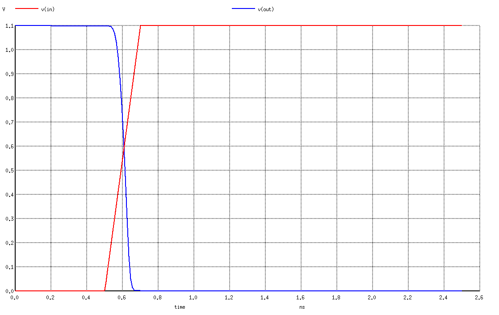

ECE 5745 Tutorial 10: SPICE Simulation
==========================================================================

 - Author: Christopher Batten
 - Date: February 17, 2020

**Table of Contents**

 - Introduction
 - Simulating an NMOS Discharging a Load Capacitance
 - Simulating an NMOS Charging a Load Capacitance

Introduction
--------------------------------------------------------------------------

ngspice is an open-source SPICE simulator for electrical circuits. We can
use it to try out some circuit simulations as we go through the semester.
In this tutorial, we explore two simple circuits: an NMOS transistor
discharging a load capacitance and an NMOS transistor charging a load
capacitance. We can use ngspice to simulate these two scenarios and plot
the voltages on various nets.

ngspice takes as input a _SPICE deck_. This is a text file which
describes the circuit you want to simulate along with what kind of
analysis you would like to perform on your circuit. You can learn more
about SPICE decks in Chapter 8 of Weste & Harris. You can also look at
the ngspice documentation:

 - http://ngspice.sourceforge.net/docs/ngspice-30-manual.pdf

The first step is to source the setup script, clone this repository from
GitHub, and define an environment variable to keep track of the top
directory for the project.

    % source setup-ece5745.sh
    % mkdir $HOME/ece5745
    % cd $HOME/ece5745
    % git clone git@github.com:cornell-ece5745/ece5745-tut10-spice
    % cd ece5745-tut10-spice
    % TOPDIR=$PWD

Simulating an NMOS Discharging a Load Capacitance
--------------------------------------------------------------------------

Here is a simple SPICE deck for the first scenario where we have an NMOS
transistor discharging a load capacitance.

    * MMOS Discharging Capacitor
    * ========================================================================

    * Parameters and Models
    * ------------------------------------------------------------------------

    .param  VDD='1.1V'
    .option scale=450nm
    .temp   70
    .inc "/classes/ece5745/install/adk-pkgs/freepdk-45nm/view-stdview/pdk-models.sp"

    * Supply Voltage Source
    * ------------------------------------------------------------------------

    Vdd vdd gnd VDD

    * Transistors
    * ------------------------------------------------------------------------

    *  src   gate drain body type
    M1 gnd   in   out   gnd  NMOS_VTL W=1 L=0.1

    * Output Load
    * ------------------------------------------------------------------------

    CLoad out gnd 12fF

    * Input Signals
    * ------------------------------------------------------------------------

    VIN_ in gnd pwl( 0ns 0V 0.5ns 0V 0.7ns 1.1V )

    * Analysis
    * ------------------------------------------------------------------------

    .ic   V(out)=VDD
    .tran 0.01ns 2.5ns

    .control
    run
    set color0=white
    set color1=black
    set xbrushwidth=2
    plot V(in) V(out)
    .endc

    .end

The first line in the SPICE deck must be a comment. Comments start with
an asterisk. Let's discuss each part. The first part sets up parameters
and models:

    .param  VDD='1.1V'
    .option scale=450nm
    .temp   70
    .inc "/classes/ece5745/install/adk-pkgs/freepdk-45nm/view-stdview/pdk-models.sp"

We create a constant named VDD which is the supply voltage we want to use
in our circuit. Note that VDD is -not- a voltage source or a node in our
circuit. It is just a constant. We also create a scaling factor so
transistor sizes can be expressed as multiples of the minimum width of a
NMOS transistor. If we look at our standard cell library for a INV_X1 we
can see that the NMOS has a width of 415nm and a length of 50nm. So for
simplicity we will use a scale factor such that a width of 1 is equal to
450nm. This means the length will always be 0.1 (i.e., 0.1 * 450nm =
45nm). We set the temperature we want to use for the simulation. Finally,
we include the model files associated with the technology we want to use.
We will be using the FreePDK 45nm technology in the labs/projects, so
here we are including the transistor models from that technology.

The next part instantiates a supply voltage source:

     Vdd vdd gnd VDD

SPICE decks have this weird thing where the very first character of a
line indicates the kind of circuit element you want to instantiate. The
book gives many more examples. If the first character is a `V`
then it is a voltage source. So here we are creating a voltage source
betwen two nodes named `vdd` and `gnd`. Note that SPICE
decks are case sensitive. The voltage source is a constant 1.1V. We just
use the constant `VDD` so we can set the supply voltage in one place at
the top of the deck.

The next part instantiates a transistor:

    *  src   gate drain body type
    M1 gnd   in   out   gnd  NMOS_VTL W=1 L=0.1

The first letter is an `M` which means MOSFET. We specify nodes for the
source, gate, drain, and body. We also indicate whether this is an NMOS
or PMOS and the width and length (in units of the scale factor mentioned
above). So the above example creates a "minimum" sized NMOS transistor,
where "minimum" means the NMOS we will be using in a minimum sized
inverter.

The next part instantiates an output load:

    CLoad out gnd 12fF

The first letter is a `C` which means capacitor. We specify the positive
and negative terminals and the capacitance.

The next part instantiates another voltage source, but this source will
be used for the input signal:

    VIN_ in gnd pwl( 0ns 0V 0.5ns 0V 0.7ns 1.1V )

Here we can use `pwl` to create a piece-wise-linear voltage signal.

The final part specifies what analysis we want to do:

    .ic   V(out)=VDD
    .tran 0.01ns 2.5ns

    .control
    run
    set color0=white
    set color1=black
    set xbrushwidth=2
    plot V(in) V(out)
    .endc

So the `.ic` line sets an initial condition. Here we want to make sure
the output node is initially charged up. The `.tran` line specifies that
we want to do transient analysis for 2.5ns in 0.01ns timesteps. The
`.control`/`.endc` block is a set of interactive commands which run the
simulation and then plot the results.

Now let's run the simulation using ngspice:

    % cd $TOPDIR/sim
    % ngspice nmos-discharge-cap.sp

A little plot should pop up that looks like the following. This plot
clearly shows Vin going from 0V to 1.1V and Vout going from 1.1V to 0V.
Everything is "full rail".

Simulating an NMOS Charging a Load Capacitance
--------------------------------------------------------------------------

Now let's try a similar experiment except this time we are going to use
the NMOS transistor to charge up an output load. Here is the
corresponding spice deck:

    * MMOS Charging Capacitor
    * ========================================================================

    * Parameters and Models
    * ------------------------------------------------------------------------

    .param  VDD='1.1V'
    .option scale=450nm
    .temp   70
    .inc "/classes/ece5745/install/adk-pkgs/freepdk-45nm/view-standard/pdk-models.sp"

    * Supply Voltage Source
    * ------------------------------------------------------------------------

    Vdd vdd gnd VDD

    * Transistors
    * ------------------------------------------------------------------------

    *  src   gate drain body type
    M1 vdd   in   out   gnd  NMOS_VTL W=1 L=0.1

    * Output Load
    * ------------------------------------------------------------------------

    CLoad out gnd 12fF

    * Input Signals
    * ------------------------------------------------------------------------

    Vin in gnd pwl( 0ns 0V 0.5ns 0V 0.7ns VDD )

    * Analysis
    * ------------------------------------------------------------------------

    .ic   V(out)=0V
    .tran 0.01ns 2.5ns

    .control
    run
    set color0=white
    set color1=black
    set xbrushwidth=2
    plot V(in) V(out) V(in)-V(out) V(vdd)-V(out)
    .endc

    .end

This is similar to what we had above except now the source of the NMOS
transistor is connected to vdd, and we set the initial condition such
that the output load is initially discharged. Now let's run the
simulation using ngspice:

    % cd $TOPDIR/sim
    % ngspice nmos-charge-cap.sp

A little plot should pop up that looks like the following. This plot
shows things are not working as well! Vin obviously goes from 0V to 1.1V,
but Vout goes from 0V and then starts to level off around 0.8V. It never
reaches 1.1V. Why? Well, we are also plotting Vgs (this is the organize
line, it is V(in)-V(out)). You can see that Vgs goes up but then starts
to go down because Vout is increasing! The transistor starts to turn off
an this prevents us from fully charging up Vout. Notice that Vout is
still slowly increasing ... this is probably due to some second order
effect like leakge or more likely that the NMOS is not 100% off since Vgs
is right around the threshold voltage.

