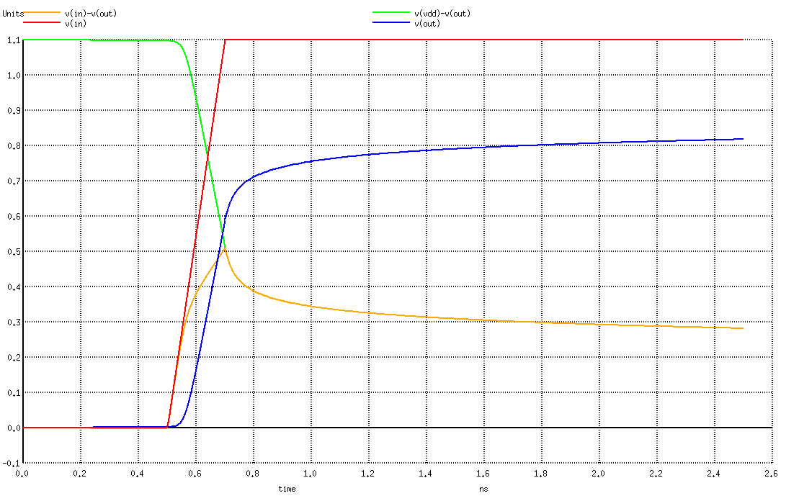

ECE 5745 Tutorial 10: SPICE Simulation
==========================================================================

 - Author: Christopher Batten
 - Date: March 14, 2021

**Table of Contents**

 - Introduction
 - Simulating an NMOS Discharging a Load Capacitance
 - Simulating an NMOS Charging a Load Capacitance
 - Simulating Simple Logic Gates
 - Simulating Standard Cells
 - To Do On Your Own

Introduction
--------------------------------------------------------------------------

ngspice is an open-source SPICE simulator for electrical circuits. We can
use it to try out some circuit simulations as we go through the semester.
In this tutorial, we will start by exploring two simple circuits: an NMOS
transistor discharging a load capacitance and an NMOS transistor charging
a load capacitance. We can use ngspice to simulate these two scenarios
and plot the voltages on various nets. We will then simulate simple logic
gates constructed explicitly using transistors, before simulating a few
gates from a standard cell library.

ngspice takes as input a _SPICE deck_. This is a text file which
describes the circuit you want to simulate along with what kind of
analysis you would like to perform on your circuit. You can learn more
about SPICE decks in Chapter 8 of Weste & Harris. You can also look at
the ngspice documentation:

 - http://ngspice.sourceforge.net/docs/ngspice-34-manual.pdf

The first step is to source the setup script, clone this repository from
GitHub, and define an environment variable to keep track of the top
directory for the project.

    % source setup-ece5745.sh
    % mkdir $HOME/ece5745
    % cd $HOME/ece5745
    % git clone git@github.com:cornell-ece5745/ece5745-tut10-spice
    % cd ece5745-tut10-spice
    % TOPDIR=$PWD

Simulating an NMOS Discharging a Load Capacitance
--------------------------------------------------------------------------

Here is a simple SPICE deck for the first scenario where we have an NMOS
transistor discharging a load capacitance.

    * MMOS Discharging Capacitor
    * ========================================================================

    * Parameters and Models
    * ------------------------------------------------------------------------

    .param VDD='1.1V'
    .temp  25
    .inc   "/classes/ece5745/install/adk-pkgs/freepdk-45nm/stdview/pdk-models.sp"

    * Supply Voltage Source
    * ------------------------------------------------------------------------

    Vdd vdd gnd VDD

    * Transistors
    * ------------------------------------------------------------------------

    *  src  gate drain body type
    M1 gnd  in   out   gnd  NMOS_VTL W=0.450um L=0.045um

    * Output Load
    * ------------------------------------------------------------------------

    Cload out gnd 7fF

    * Input Signals
    * ------------------------------------------------------------------------

    Vin in gnd pwl( 0ns 0V 0.5ns 0V 0.7ns VDD )

    * Analysis
    * ------------------------------------------------------------------------

    .ic   V(out)=VDD
    .tran 0.01ns 2.5ns

    .control
    run
    set color0=white
    set color1=black
    set xbrushwidth=2
    plot V(in) V(out)
    .endc

    .end

The first line in the SPICE deck must be a comment. Comments start with
an asterisk. Let's discuss each part. The first part sets up parameters
and models:

    .param VDD='1.1V'
    .temp  25
    .inc   "/classes/ece5745/install/adk-pkgs/freepdk-45nm/stdview/pdk-models.sp"

We create a constant named VDD which is the supply voltage we want to use
in our circuit. Note that VDD is -not- a voltage source or a node in our
circuit. It is just a constant. We set the temperature we want to use for
the simulation. Finally, we include the model files associated with the
technology we want to use. We will be using the FreePDK 45nm technology
in the labs/projects, so here we are including the transistor models from
that technology.

The next part instantiates a supply voltage source:

     Vdd vdd gnd VDD

SPICE decks have this weird thing where the very first character of a
line indicates the type of circuit element you want to instantiate. The
book gives many more examples. If the first character is a `V` then it is
a voltage source. So here we are creating a voltage source between two
nodes named `vdd` and `gnd`. Other examples include `R` for resistor, `C`
for capacitor, `M` for MOSFET transistor, `A` for models with special
code, and `X` for subcircuits. Note that SPICE decks are case sensitive.
The voltage source is a constant 1.1V. We just use the constant `VDD` so
we can set the supply voltage in one place at the top of the deck.

The next part instantiates a transistor:

    *  src   gate drain body type
    M1 gnd   in   out   gnd  NMOS_VTL W=0.450um L=0.045um

The first letter is an `M` which means MOSFET. We specify nodes for the
source, gate, drain, and body. We also indicate whether this is an NMOS
or PMOS and the width and length in micron. This is a 45nm technology, so
we use the minimum transistor length of 45nm (0.045um). If we look at our
Nangate standard cell library for a INV_X1 we can see that the NMOS has a
width of about 10x the length, so for we make the NMOS width to be
0.450um. So the above example creates a "minimum" sized NMOS transistor,
where "minimum" means the NMOS we will be using in a minimum sized
inverter.

The next part instantiates an output load:

    Cload out gnd 7fF

The first letter is a `C` which means capacitor. We specify the positive
and negative terminals and the capacitance. An INV_X4 inverter has an
input cap of 6.25fF so we round up to 7fF as a reasonable output load.

The next part instantiates another voltage source, but this source will
be used for the input signal:

    Vin in gnd pwl( 0ns 0V 0.5ns 0V 0.7ns 1.1V )

Here we can use `pwl` to create a piece-wise-linear voltage signal.

The final part specifies what analysis we want to do:

    .ic   V(out)=VDD
    .tran 0.01ns 2.5ns

    .control
    run
    set color0=white
    set color1=black
    set xbrushwidth=2
    plot V(in) V(out)
    .endc

So the `.ic` line sets an initial condition. Here we want to make sure
the output node is initially charged up. The `.tran` line specifies that
we want to do transient analysis for 2.5ns in 0.01ns timesteps. The
`.control`/`.endc` block is a set of interactive commands which run the
simulation and then plot the results.

Now let's run the simulation using ngspice:

    % cd $TOPDIR/sim
    % ngspice nmos-discharge-cap-sim.sp

A little plot should pop up that looks like the following. This plot
clearly shows Vin going from 0V to 1.1V and Vout going from 1.1V to 0V.
Everything is "full rail".

**To Do On Your Own:** Increase the load capacitance by 10x and then 100x
and observe the impact on the time to discharge the capacitor.

Simulating an NMOS Charging a Load Capacitance
--------------------------------------------------------------------------

Now let's try a similar experiment except this time we are going to use
the NMOS transistor to charge up an output load. Here is the
corresponding spice deck:

    * MMOS Charging Capacitor
    * ========================================================================

    * Parameters and Models
    * ------------------------------------------------------------------------

    .param VDD='1.1V'
    .temp  25
    .inc   "/classes/ece5745/install/adk-pkgs/freepdk-45nm/stdview/pdk-models.sp"

    * Supply Voltage Source
    * ------------------------------------------------------------------------

    Vdd vdd gnd VDD

    * Transistors
    * ------------------------------------------------------------------------

    *  src  gate drain body type
    M1 vdd  in   out   gnd  NMOS_VTL W=0.450um L=0.045um

    * Output Load
    * ------------------------------------------------------------------------

    CLoad out gnd 7fF

    * Input Signals
    * ------------------------------------------------------------------------

    Vin in gnd pwl( 0ns 0V 0.5ns 0V 0.7ns VDD )

    * Analysis
    * ------------------------------------------------------------------------

    .ic   V(out)=0V
    .tran 0.01ns 2.5ns

    .control
    run
    set color0=white
    set color1=black
    set xbrushwidth=2
    plot V(in) V(out) V(in)-V(out) V(vdd)-V(out)
    .endc

    .end

This is similar to what we had above except now the source of the NMOS
transistor is connected to vdd, and we set the initial condition such
that the output load is initially discharged. Now let's run the
simulation using ngspice:

    % cd $TOPDIR/sim
    % ngspice nmos-charge-cap-sim.sp

A little plot should pop up that looks like the following. This plot
shows things are not working as well! Vin obviously goes from 0V to 1.1V,
but Vout goes from 0V and then starts to level off around 0.8V. It never
reaches 1.1V. Why? Well, we are also plotting Vgs (this is the organize
line, it is V(in)-V(out)). You can see that Vgs goes up but then starts
to go down because Vout is increasing! The transistor starts to turn off
an this prevents us from fully charging up Vout. Notice that Vout is
still slowly increasing ... this is probably due to some second order
effect like leakage or more likely that the NMOS is not 100% off since
Vgs is right around the threshold voltage.

**To Do On Your Own:** Increase the load capacitance by 10x and then 100x
and observe the impact on the time to discharge the capacitor.

Simulating Simple Logic Gates
--------------------------------------------------------------------------

Let's experiment with some simple logic gates. Take a look at the SPICE
deck in `inv-sim.sp` which contains the canonical minimum sized inverter:

    *  src  gate drain body type
    M1 vdd  in   out   vdd  PMOS_VTL W=0.900um L=0.045um
    M2 gnd  in   out   gnd  NMOS_VTL W=0.450um L=0.045um

Notice how the PMOS transistor is sized to be twice the size of the
minimum-sized NMOS transistor. We can use a more complicated piece-wise
linear voltage source to toggle the input to the inverter:

    Vin in gnd pwl
    + (
    +   0.0ns  0V
    +   0.4ns  0V
    +   0.6ns VDD
    +   0.9ns VDD
    +   1.1ns VDD
    +   1.4ns VDD
    +   1.6ns  0V
    +   1.9ns  0V
    + )

We can use `+` to continue a long line SPICE command across multiple
lines in the SPICE deck. Here we have formatted the piece-wise linear
voltage source to look a little like a table. The input is low for 0.5ns,
then goes high for 1ns, and then goes low again for 0.5ns. Our SPICE deck
also includes some measurement commands:

    .measure tran tpdr trig v(in) val='VDD/2' fall=1 targ v(out) val='VDD/2' rise=1
    .measure tran tpdf trig v(in) val='VDD/2' rise=1 targ v(out) val='VDD/2' fall=1
    .measure tran tpd param='(tpdr+tpdf)/2'

The ngspice manual explains measurement commands in more detail. Briefly,
the first command measures the propagation delay for a low-to-high output
transition, and the second command measures the propagation delay for a
high-to-low output transition. These delays are measured from when the
input is VDD/2 to when the output is VDD/2. The third measurement command
uses the average of these two propagation delays to estimate the overall
propagation delay of the inverter. Chapter 8 of Weste & Harris discusses
in more detail how to effectively characterize various CMOS circuits. Now
let's run the simulation using ngspice:

    % cd $TOPDIR/sim
    % ngspice inv-sim.sp
    ...
    tpdr = 1.037703e-11 targ = 1.510377e-09 trig = 1.500000e-09
    tpdf = 2.409571e-11 targ = 5.240957e-10 trig = 5.000000e-10
    tpd  = 1.72364e-11

A little plot should pop up that shows the input and output voltages, and
the measurement results will be displayed in the terminal. The
propagation delay is approximately 17.2ps.

**To Do On Your Own:** Increase the load capacitance by 10x and then 100x
and observe the impact on the propagation delay. Make sure you look at
the actual waveforms to see if the output has time to go full rail. If
not, you need to increase the time between input transitions to make an
accurate estimate of the propagation delay.

Creating these voltage sources can be very tedious, especially when we
want to drive multiple inputs. We can take advantage of ngspice's support
for mixed-signal analog/digital simulation to simplify the task of
creating many digital input values. Take a look at the SPICE deck in
`inv-dsource-sim.sp` to see a different way of generating input sources:

    A1 [in_] inv_source
    .model inv_source d_source (input_file="inv-source.txt")

Here we are instantiating a `d_source` and giving this new component the
name `a1`. The `d_source` reads an input text file to see the values of
the given input nodes (i.e., `in_`). The `inv-source.txt` file looks like
this:

    * inv-source.txt
    * ====================================================================

    * time in
    0.0ns  0s
    1.0ns  1s
    2.0ns  0s

Lines that start with `*` are comments. The first column corresponds to
time and each remaining column corresponds to an input node. The input
node can be either `0s` (for a strong logic zero) or `1s` (for a strong
logic one). So the above example toggles the input node just as with the
previous piece-wise linear voltage source. Note that there is a
positional mapping from the columns in the text file to the nodes in the
SPICE deck when instantiating the `d_source`. So the second column maps
to the `in_` input node.

We also need to instantiate a digital-to-analog converter (DAC) to
translate the digital values into analog values suitable for driving a
CMOS circuit:

    Ain [in_] [in] dac_in
    .model dac_in dac_bridge (out_low=0V out_high='VDD' t_rise=0.2ns t_fall=0.2ns)

The `dac_bridge` component takes parameters specifying the logic low and
logic high voltage levels and the rise/fall times. We also need to
specify the mapping from digital input nodes (`in_`) to analog input
nodes (`in`). Now let's run the simulation using ngspice and confirm that
the result is the same as when using piece-wise linear voltage sources:

    % cd $TOPDIR/sim
    % ngspice inv-dsource-sim.sp

Now let's experiment with a NAND2 gate. Take a look at the SPICE deck in
`nand2-sim.sp` which contains the canonical NAND2 gate:

    *  src  gate drain body type
    M1 vdd  a    y     vdd  PMOS_VTL W=0.900um L=0.045um
    M2 vdd  b    y     vdd  PMOS_VTL W=0.900um L=0.045um
    M3 n0   a    y     gnd  NMOS_VTL W=0.900um L=0.045um
    M4 gnd  b    n0    gnd  NMOS_VTL W=0.900um L=0.045um

Notice how we have sized this NAND2 gate to have equal worst-case rise
and fall times assuming a PMOS/NMOS mobility ratio of two, and we have
also sized this NAND2 gate to have similar effective resistance as the
canonical minimum-sized inverter

**To Do On Your Own:** Copy the `nand2-sim.sp` SPICE deck to create a new
file named `nor2-sim.sp` and copy the `nand2-source.txt` input file to
create a new file named `nor2-source.txt`. Replace the NAND2 gate with an
explicit transistor implementation of a NOR2 gate. Size the NOR2 gate to
have equal worst-case rise and fall times assuming a PMOS/NMOS mobility
ratio of two and similar effective resistance as the canonical
minimum-sized inverter. Run the simulation and verify the functionality
using the waveforms.

Simulating Standard Cells
--------------------------------------------------------------------------

A standard cell library will include many views including SPICE decks for
each standard cell. Actually, the standard cell library will usually
include two kinds of SPICE decks. The _schematic SPICE deck_ includes
just the transistors, while the _extracted SPICE deck_ will include all
of the extracted parasitic resistances and capacitances. Take a look at
the schematic SPICE deck for a minimum sized inverter (INV_X1):

    % less -p INV_X1 $ECE5745_STDCELLS/stdcells.spi
    .SUBCKT INV_X1 A ZN VDD VSS
    *.PININFO A:I ZN:O VDD:P VSS:G
    *.EQN ZN=!A
    M_i_0 ZN A VSS VSS NMOS_VTL W=0.415000U L=0.050000U
    M_i_1 ZN A VDD VDD PMOS_VTL W=0.630000U L=0.050000U
    .ENDS

The SPICE deck for an inverter is encapsulated in a SPICE subcircuit
(`SUBCKT`). A subcircuit is like a PyMTL3 or Verilog module with an
interface (i.e., list of ports) and an implementation (i.e.,
instantiating transistors or other subcircuits). In this case, the INV_X1
gate includes four ports: the input (`A`), the output (`ZN`), the power
supply (`VDD`) and ground (`VSS`). As expected, the implementation
includes a PMOS and NMOS transistor. Notice that even though the minimum
length transistor in this technology is 0.045um, both transistors are
0.050um. This is actually quite common. Standard cells often use slightly
longer transistors to offer a better performance vs. power trade-off
(i.e., lower leakage). Some standard cell libraries will actually include
different implementations of every gate each with a different channel
length. Also notice how the PMOS is only 1.5x larger than the NMOS.
Again, this is actually quite common. A PMOS/NMOS mobility ratio of two
is just an assumption; a specific technology will likely have a different
mobility ratio which is often less than two. Standard cells will also
often have slightly skewed rise/fall times to offer a better area vs.
noise margin trade-off.

While we could certainly simulate the schematic SPICE deck, it is more
useful to simulate the extracted SPICE deck since this will provide
accurate performance analysis. Take a loo at the extracted SPICE deck for
a minimum sized inverter (INV_X1):

    % less -p INV_X1 $ECE5745_STDCELLS/stdcells-lpe.spi
    .SUBCKT INV_X1 VDD VSS A ZN
    *.PININFO VDD:P VSS:G A:I ZN:O
    *.EQN ZN=!A
    M_M1 N_ZN_M0_d N_A_M0_g N_VDD_M0_s VDD PMOS_VTL W=0.630000U L=0.050000U
    M_M0 N_ZN_M1_d N_A_M1_g N_VSS_M1_s VSS NMOS_VTL W=0.415000U L=0.050000U
    C_x_PM_INV_X1%VDD_c0 x_PM_INV_X1%VDD_31 VSS 4.13109e-17
    C_x_PM_INV_X1%VDD_c1 x_PM_INV_X1%VDD_19 VSS 2.61599e-16
    C_x_PM_INV_X1%VDD_c2 x_PM_INV_X1%VDD_18 VSS 1.89932e-17
    C_x_PM_INV_X1%VDD_c3 N_VDD_M0_s VSS 3.88255e-17
    C_x_PM_INV_X1%VDD_c4 x_PM_INV_X1%VDD_12 VSS 1.92462e-17
    C_x_PM_INV_X1%VDD_c5 x_PM_INV_X1%VDD_11 VSS 2.334e-16
    C_x_PM_INV_X1%VDD_c6 x_PM_INV_X1%VDD_8 VSS 5.52247e-16
    R_x_PM_INV_X1%VDD_r7 VDD x_PM_INV_X1%VDD_31 0.13879
    R_x_PM_INV_X1%VDD_r8 VDD x_PM_INV_X1%VDD_28 0.392137
    ...
    .ENDS

The INV_X1 gate still includes four ports (although they are in a
different order which is annoying), but notice that the implementation is
radically different. There are ~50 parasitic resistances and capacitances
extracted from the actual layout for this standard cell. These parasitics
are what enable more accurate performance analysis.

Take a look at the SPICE deck in `inv-stdcell-sim.sp` which is meant for
simulating the INV_X1 standard cell. First, notice that we need to
include the standard cell SPICE deck:

    .param VDD='1.1V'
    .temp  25
    .inc   "/classes/ece5745/install/adk-pkgs/freepdk-45nm/stdview/pdk-models.sp"
    .inc   "/classes/ece5745/install/adk-pkgs/freepdk-45nm/stdview/stdcells-lpe.spi"

Instead of directly instantiating transistors, we simply instantiate the
`INV_X1` subcircuit:

    X1 vdd gnd in out INV_X1

The instance name of subcircuits (`X1`) must start with `X`. The instance
name is followed by the list of nodes that should be connected to the
ports of the subcircuit. The nodes are connected by position. So since
the port list in the subcircuit definition is `VDD VSS A ZN`, we must
list the nodes in the subcircuit instance in the exact same order.
The subcircuit instance ends with the type of subcircuit we wish to
instantiate. The rest of the SPICE deck is the same as earlier in the
tutorial. Let's run the simulation using ngspice:

    % cd $TOPDIR/sim
    % ngspice inv-stdcell-sim.sp
    ...
    tpdr = 2.577757e-11 targ = 2.125778e-09 trig = 2.100000e-09
    tpdf = 2.275623e-11 targ = 1.122756e-09 trig = 1.100000e-09
    tpd  = 2.42669e-11

Recall that the propagation delay when we instantiated transistors
directly was 17.2ps while now it is 24.3ps. The extracted SPICE decks are
almost always slower than schematic SPICE decks, since we are actually
modeling the parasitic resistances and capacitances.

**To Do On Your Own:** Increase the load capacitance by 10x and then 100x
and observe the impact on the propagation delay. Make sure you look at
the actual waveforms to see if the output has time to go full rail. If
not, you need to increase the time between input transitions to make an
accurate estimate of the propagation delay.

Now let's experiment with the NAND2_X1 gate from the standard cell
library. Take a look at the SPICE deck in `nand2-stdcell-sim.sp` which
instantiates the appropriate subcircuit, then run the simulation using
ngspice:

    % cd $TOPDIR/sim
    % ngspice nand2-stdcell-sim.sp

**To Do On Your Own:** Copy the `nand2-stdcell-sim.sp` SPICE deck to
create a new file named `nor2-stdcell-sim.sp` and copy the
`nand2-source.txt` input file to create a new file named
`nor2-source.txt`. Replace the NAND2_X1 subcircuit instance with an
instance of the NOR2_X1 gate from the standard cell library. Run the
simulation and verify the functionality using the waveforms.

To Do On Your Own
--------------------------------------------------------------------------

The Nangate standard cell library includes a full-adder gate:

    % less -p FA_X1 $ECE5745_STDCELLS/stdcells-lpe.spi
    .SUBCKT FA_X1 VDD VSS CO CI A B S
    *.PININFO VDD:P VSS:G CO:O CI:I A:I B:I S:O
    *.EQN CO=((A * B) + (CI * (A + B)));S=(CI ^ (A ^ B))
    M_M14 N_VDD_M0_d N_4_M0_g N_CO_M0_s VDD PMOS_VTL W=0.630000U L=0.050000U
    M_M15 net_007 N_B_M1_g N_VDD_M0_d VDD PMOS_VTL W=0.315000U L=0.050000U
    M_M16 N_4_M2_d N_A_M2_g net_007 VDD PMOS_VTL W=0.315000U L=0.050000U
    M_M17 N_6_M3_d N_CI_M3_g N_4_M2_d VDD PMOS_VTL W=0.315000U L=0.050000U
    M_M18 N_VDD_M4_d N_A_M4_g N_6_M3_d VDD PMOS_VTL W=0.315000U L=0.050000U
    M_M19 N_6_M5_d N_B_M5_g N_VDD_M4_d VDD PMOS_VTL W=0.315000U L=0.050000U
    M_M20 N_11_M6_d N_B_M6_g N_VDD_M6_s VDD PMOS_VTL W=0.315000U L=0.050000U
    M_M21 N_VDD_M7_d N_CI_M7_g N_11_M6_d VDD PMOS_VTL W=0.315000U L=0.050000U
    M_M22 N_11_M8_d N_A_M8_g N_VDD_M7_d VDD PMOS_VTL W=0.315000U L=0.050000U
    M_M23 N_12_M9_d N_4_M9_g N_11_M8_d VDD PMOS_VTL W=0.315000U L=0.050000U
    M_M24 net_010 N_CI_M10_g N_12_M9_d VDD PMOS_VTL W=0.315000U L=0.050000U
    M_M25 net_009 N_B_M11_g net_010 VDD PMOS_VTL W=0.315000U L=0.050000U
    M_M26 N_VDD_M12_d N_A_M12_g net_009 VDD PMOS_VTL W=0.315000U L=0.050000U
    M_M27 N_S_M13_d N_12_M13_g N_VDD_M12_d VDD PMOS_VTL W=0.630000U L=0.050000U
    M_M0 N_VSS_M14_d N_4_M14_g N_CO_M14_s VSS NMOS_VTL W=0.415000U L=0.050000U
    M_M1 net_000 N_B_M15_g N_VSS_M14_d VSS NMOS_VTL W=0.210000U L=0.050000U
    M_M2 N_4_M16_d N_A_M16_g net_000 VSS NMOS_VTL W=0.210000U L=0.050000U
    M_M3 N_7_M17_d N_CI_M17_g N_4_M16_d VSS NMOS_VTL W=0.210000U L=0.050000U
    M_M4 N_VSS_M18_d N_A_M18_g N_7_M17_d VSS NMOS_VTL W=0.210000U L=0.050000U
    M_M5 net_002 N_B_M19_g N_VSS_M18_d VSS NMOS_VTL W=0.210000U L=0.050000U
    M_M6 net_006 N_B_M20_g N_VSS_M20_s VSS NMOS_VTL W=0.210000U L=0.050000U
    M_M7 N_VSS_M21_d N_CI_M21_g net_006 VSS NMOS_VTL W=0.210000U L=0.050000U
    M_M8 N_10_M22_d N_A_M22_g N_VSS_M21_d VSS NMOS_VTL W=0.210000U L=0.050000U
    M_M9 N_12_M23_d N_4_M23_g N_10_M22_d VSS NMOS_VTL W=0.210000U L=0.050000U
    M_M10 net_004 N_CI_M24_g N_12_M23_d VSS NMOS_VTL W=0.210000U L=0.050000U
    M_M11 net_003 N_B_M25_g net_004 VSS NMOS_VTL W=0.210000U L=0.050000U
    M_M12 N_VSS_M26_d N_A_M26_g net_003 VSS NMOS_VTL W=0.210000U L=0.050000U
    M_M13 N_S_M27_d N_12_M27_g N_VSS_M26_d VSS NMOS_VTL W=0.415000U L=0.050000U
    ...
    .ENDS

Try instantiating and chaining four of these gates together to create a
four-bit ripple-carry adder. Create an appropriate SPICE deck to drive
the simulation including a `d_source` that reads in a text file with the
two four-bit input values. Here is what the results look like if you
start with adding 0b1111 to 0b0000 and then change the b input to 0b0001
at 200ps. Notice the sum outputs transitioning from 0 to 1 as the carry
is propagated through the full-adder gates. As discussed in Chapter 8 of
Weste & Harris, for more accurate performance analysis you would need to
add inverters to the inputs for realistic waveform shaping and to the
outputs for realistic load capacitance.

